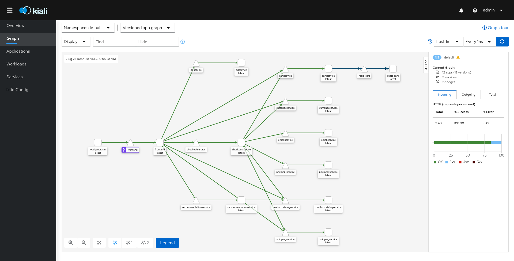

# Lab 3 - Integrating an app

In this laboratory, we will learn how to modify our application in order to work with Istio. For that purpose, we will use the [Online Boutique](https://github.com/GoogleCloudPlatform/microservices-demo) a sample microservices application provided by Google.


While integrating an application with Istio, we must following these simple steps:

- Deploy in Kubernetes our services injected with Istio sidecards.
- Deploy Istio networking services to K8s for the services with our custom rules and configuration.

## 1. Downloading microservices-demo application

```sh
git clone git@github.com:GoogleCloudPlatform/microservices-demo.git
git reset --hard v0.2.1
cd microservices-demo
```

## 2. Testing microservices-demo application without Istio

1. Disable istio-injection:

    ```sh
    kubectl label namespace default istio-injection=disabled --overwrite
    ```

2. Deploy the application:

    ```sh
    kubectl apply -f ./release/kubernetes-manifests.yaml
    ```

3. Run to see pods are in a Ready state and wait until all pods have all pods instances `READY` and `STATUS` in **Running**:

    ```sh
    kubectl get pods
    ```

4. Open application to outside traffic:

    ```sh
    kubectl port-forward deployment/frontend 18080:8080
    ```

5. Open the [Online Boutique](http://localhost:18080/) in your browser.

6. Destroy the deployment.

    ```sh
    kubectl delete -f ./release/kubernetes-manifests.yaml
    ```

::: warning Errors while setting up microservices-demo
Sometimes, this demo application has several problems when you deploy it into Kubernetes.

If you have waited too much time, try destroying the deployment and launching it again.
:::

## 3. Injecting Istio sidecar into the application

Istio helps developers while integrating their apps into the service mesh. It is as easy as executing `istioctl kube-inject` command for the application manifest:

```sh
istioctl kube-inject -f ./release/kubernetes-manifests.yaml
```

Now, check a single service in order to see the current changes made by `istioctl`:

- Default K8s deployment specification:

    <<< @/docs/laboratory-03/files/microservicesdemo_default.yaml

- Specification injected with the sidecard:

    <<< @/docs/laboratory-03/files/microservicesdemo_sidecard.yaml

As you can see, the service is modified deeply adding a lot new stuff. Next, We will learn what Istio does.

## 4. Sidecar injection

In simple terms, sidecar injection is adding the configuration of additional containers to the pod template. The added containers needed for the Istio service mesh are:

`istio-init` This init container is used to setup the iptables rules so that inbound/outbound traffic will go through the sidecar proxy. An init container is different than an app container in following ways:

- It runs before an app container is started and it always runs to completion.
- If there are many init containers, each should complete with success before the next container is started.

So, you can see how this type of container is perfect for a set-up or initialization job which does not need to be a part of the actual application container. In this case, istio-init does just that and sets up the iptables rules.

`istio-proxy` This is the actual sidecar proxy (based on Envoy).

### 4.1 Automatic injection

Most of the times, you don’t want to manually inject a sidecar every time you deploy an application, using the `istioctl` command, but would prefer that Istio automatically inject the sidecar to your pod. This is the recommended approach and for it to work, all you need to do is to label the namespace where you are deploying the app with istio-injection=enabled.

Once labeled, Istio injects the sidecar automatically for any pod you deploy in that namespace. In the following example, the sidecar gets automatically injected in the deployed pods in the istio-dev namespace.

## 5. Deploying microservices-demo with Istio

1. Deploy the application:

    ```sh
    istioctl kube-inject -f ./release/kubernetes-manifests.yaml | kubectl apply -f -
    ```

2. Run to see pods are in a Ready state:

    ```sh
    kubectl get pods
    ```

## 6. Adding external HTTPS connectivity through Istio

Istio by default is high secure, so no connectivity is added if you do not say so. Now, we will deploy a new manifest adding connectivity services through Istio:

- [istio-micro-services-networking.yaml](../istio-micro-services-networking.yaml):

    <<< @/docs/laboratory-03/files/microservicesdemo_https.yaml

1. Download [istio-micro-services-networking.yaml](../istio-micro-services-networking.yaml).

2. Create certificate for the gateway and its custom domain:

    ```sh
    openssl req -x509 -sha256 -nodes -days 365 -newkey rsa:2048 -subj '/O=example Inc./CN=example.com' -keyout example.com.key -out example.com.crt
    openssl req -out microservices-demo.example.com.csr -newkey rsa:2048 -nodes -keyout microservices-demo.example.com.key -subj "/CN=microservices-demo.example.com/O=microservices-demo organization"
    openssl x509 -req -days 365 -CA example.com.crt -CAkey example.com.key -set_serial 0 -in microservices-demo.example.com.csr -out microservices-demo.example.com.crt
    ```

3. Upload certificate to kubernetes:

    ```sh
    kubectl create -n istio-system secret tls microservices-demo-credential --key=microservices-demo.example.com.key --cert=microservices-demo.example.com.crt
    ```

4. Deploy necessary gateway, ingress and egress services for the application:

    ```sh
    kubectl apply -f istio-micro-services-networking.yaml
    ```

5. Ensure that there are no issues with the configuration:

    ```sh
    istioctl analyze
    ```

### 6.1 Determining the application URL

As in the previous laboratory, we will have to obtain the URL for accessing the application:

1. Obtain host and ports:

    ```sh
    export INGRESS_PORT=$(kubectl -n istio-system get service istio-ingressgateway -o jsonpath='{.spec.ports[?(.name=="http2")].nodePort}')
    export SECURE_INGRESS_PORT=$(kubectl -n istio-system get service istio-ingressgateway -o jsonpath='{.spec.ports[?(.name=="https")].nodePort}')
    export INGRESS_HOST=$(minikube ip)
    export GATEWAY_URL=microservices-demo.example.com:$SECURE_INGRESS_PORT
    ```

2. Add `microservices-demo.example.com` to `/etc/hosts`:

    ```sh
    sudo bash -c "echo '$INGRESS_HOST microservices-demo.example.com ' >> /etc/hosts"
    ```

3. Run the following command to retrieve the external address of the application.

    ```sh
    echo https://"$GATEWAY_URL"
    ```

4. Access the app using precious URL:

    

## 7. Checking services using the Istio dashboard

Now, it is time to visually review what is deployed in Istio:

1. Access the Kiali dashboard. The default user name is `admin` and default password is `admin`.

    ```sh
    istioctl dashboard kiali
    ```

2. In the left navigation menu, select _Graph_ and in the _Namespace_ drop down, select _default_.

    The Kiali dashboard shows an overview of your mesh with the relationships between the services in the `Microservices Demo` sample application. It also provides filters to visualize the traffic flow.

    

## 8. Removing resources

1. Remove line that contains `microservices-demo.example.com` in `/etc/hosts`:

    ```sh
    sudo sed -i '/microservices-demo.example.com/d' /etc/hosts
    ```

2. Remove created resources:

    ```sh
    kubectl delete -f istio-micro-services-networking.yaml
    istioctl kube-inject -f ./release/kubernetes-manifests.yaml | kubectl delete -f -
    ```
