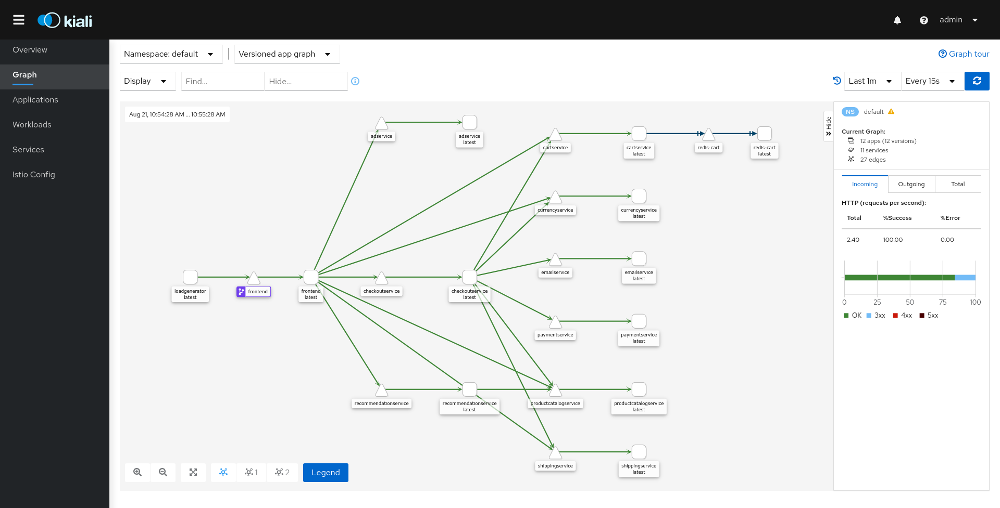

# Laboratory 3 - Integrating an application

In this laboratory, we will learn how to modify our application in order to work with Istio. For that purpose, we will use the [Online Boutique](https://github.com/GoogleCloudPlatform/microservices-demo) a sample microservices application provided by Google.


## 1. Downloading microservices-demo application

```shell
git clone git@github.com:GoogleCloudPlatform/microservices-demo.git
cd microservices-demo
```

## 2. Testing microservices-demo application without Istio

1. Disable istio-injection:

    ```shell
    kubectl label namespace istio-system istio-injection=disabled --overwrite
    ```

1. Deploy the application:

    ```shell
    kubectl apply -f ./release/kubernetes-manifests.yaml
    ```

1. Run to see pods are in a Ready state:

    ```shell
    kubectl get pods
    ```

1. Open application to outside traffic:

    ```shell
    kubectl port-forward deployment/frontend 18080:8080
    ```

1. Open the [Online Boutique](http://localhost:18080/) in your browser.

1. Destroy the deployment.

    ```shell
    kubectl destroy -f ./release/kubernetes-manifests.yaml
    ```

## 3. Injecting Istio sidecar into the application

Istio helps developers while integrating their apps into the service mesh. It is as easy as executing `istioctl kube-inject` command for the application manifest:

```shell
istioctl kube-inject -f ./release/kubernetes-manifests.yaml
```

Now, check a single service in order to see the current changes made by `istioctl`:

- Before:

    ```yaml
    apiVersion: apps/v1
    kind: Deployment
    metadata:
    name: checkoutservice
    spec:
    selector:
        matchLabels:
        app: checkoutservice
    template:
        metadata:
        labels:
            app: checkoutservice
        spec:
        containers:
            - name: server
            image: gcr.io/google-samples/microservices-demo/checkoutservice:v0.2.0
            ports:
            - containerPort: 5050
            readinessProbe:
                exec:
                command: ["/bin/grpc_health_probe", "-addr=:5050"]
            livenessProbe:
                exec:
                command: ["/bin/grpc_health_probe", "-addr=:5050"]
            env:
            - name: PORT
                value: "5050"
            - name: PRODUCT_CATALOG_SERVICE_ADDR
                value: "productcatalogservice:3550"
            - name: SHIPPING_SERVICE_ADDR
                value: "shippingservice:50051"
            - name: PAYMENT_SERVICE_ADDR
                value: "paymentservice:50051"
            - name: EMAIL_SERVICE_ADDR
                value: "emailservice:5000"
            - name: CURRENCY_SERVICE_ADDR
                value: "currencyservice:7000"
            - name: CART_SERVICE_ADDR
                value: "cartservice:7070"
            # - name: DISABLE_STATS
            #   value: "1"
            # - name: DISABLE_TRACING
            #   value: "1"
            # - name: DISABLE_PROFILER
            #   value: "1"
            # - name: JAEGER_SERVICE_ADDR
            #   value: "jaeger-collector:14268"
            resources:
                requests:
                cpu: 100m
                memory: 64Mi
                limits:
                cpu: 200m
                memory: 128Mi
    ```

- Before:

    ```yaml
    apiVersion: apps/v1
    kind: Deployment
    metadata:
    creationTimestamp: null
    name: checkoutservice
    spec:
    selector:
        matchLabels:
        app: checkoutservice
    strategy: {}
    template:
        metadata:
        annotations:
            sidecar.istio.io/interceptionMode: REDIRECT
            sidecar.istio.io/status: '{"version":"ed4e6e8ed4ffa03fe7d5b9d2c27cc8c478625ade64be2859cae3da0db9e5ee2e","initContainers":["istio-init"],"containers":["istio-proxy"],"volumes":["istio-envoy","istio-data","istio-podinfo","istiod-ca-cert"],"imagePullSecrets":null}'
            traffic.sidecar.istio.io/excludeInboundPorts: "15020"
            traffic.sidecar.istio.io/includeInboundPorts: "5050"
            traffic.sidecar.istio.io/includeOutboundIPRanges: '*'
        creationTimestamp: null
        labels:
            app: checkoutservice
            istio.io/rev: ""
            security.istio.io/tlsMode: istio
        spec:
        containers:
        - env:
            - name: PORT
            value: "5050"
            - name: PRODUCT_CATALOG_SERVICE_ADDR
            value: productcatalogservice:3550
            - name: SHIPPING_SERVICE_ADDR
            value: shippingservice:50051
            - name: PAYMENT_SERVICE_ADDR
            value: paymentservice:50051
            - name: EMAIL_SERVICE_ADDR
            value: emailservice:5000
            - name: CURRENCY_SERVICE_ADDR
            value: currencyservice:7000
            - name: CART_SERVICE_ADDR
            value: cartservice:7070
            image: gcr.io/google-samples/microservices-demo/checkoutservice:v0.2.0
            livenessProbe:
            exec:
                command:
                - /bin/grpc_health_probe
                - -addr=:5050
            name: server
            ports:
            - containerPort: 5050
            readinessProbe:
            exec:
                command:
                - /bin/grpc_health_probe
                - -addr=:5050
            resources:
            limits:
                cpu: 200m
                memory: 128Mi
            requests:
                cpu: 100m
                memory: 64Mi
        - args:
            - proxy
            - sidecar
            - --domain
            - $(POD_NAMESPACE).svc.cluster.local
            - --serviceCluster
            - checkoutservice.$(POD_NAMESPACE)
            - --proxyLogLevel=warning
            - --proxyComponentLogLevel=misc:error
            - --trust-domain=cluster.local
            - --concurrency
            - "2"
            env:
            - name: JWT_POLICY
            value: first-party-jwt
            - name: PILOT_CERT_PROVIDER
            value: istiod
            - name: CA_ADDR
            value: istiod.istio-system.svc:15012
            - name: POD_NAME
            valueFrom:
                fieldRef:
                fieldPath: metadata.name
            - name: POD_NAMESPACE
            valueFrom:
                fieldRef:
                fieldPath: metadata.namespace
            - name: INSTANCE_IP
            valueFrom:
                fieldRef:
                fieldPath: status.podIP
            - name: SERVICE_ACCOUNT
            valueFrom:
                fieldRef:
                fieldPath: spec.serviceAccountName
            - name: HOST_IP
            valueFrom:
                fieldRef:
                fieldPath: status.hostIP
            - name: CANONICAL_SERVICE
            valueFrom:
                fieldRef:
                fieldPath: metadata.labels['service.istio.io/canonical-name']
            - name: CANONICAL_REVISION
            valueFrom:
                fieldRef:
                fieldPath: metadata.labels['service.istio.io/canonical-revision']
            - name: PROXY_CONFIG
            value: |
                {"proxyMetadata":{"DNS_AGENT":""}}
            - name: ISTIO_META_POD_PORTS
            value: |-
                [
                    {"containerPort":5050}
                ]
            - name: ISTIO_META_APP_CONTAINERS
            value: |-
                [
                    server
                ]
            - name: ISTIO_META_CLUSTER_ID
            value: Kubernetes
            - name: ISTIO_META_INTERCEPTION_MODE
            value: REDIRECT
            - name: ISTIO_META_WORKLOAD_NAME
            value: checkoutservice
            - name: ISTIO_META_OWNER
            value: kubernetes://apis/apps/v1/namespaces/default/deployments/checkoutservice
            - name: ISTIO_META_MESH_ID
            value: cluster.local
            - name: DNS_AGENT
            - name: ISTIO_KUBE_APP_PROBERS
            value: '{}'
            image: docker.io/istio/proxyv2:1.6.8
            imagePullPolicy: Always
            name: istio-proxy
            ports:
            - containerPort: 15090
            name: http-envoy-prom
            protocol: TCP
            readinessProbe:
            failureThreshold: 30
            httpGet:
                path: /healthz/ready
                port: 15021
            initialDelaySeconds: 1
            periodSeconds: 2
            resources:
            limits:
                cpu: "2"
                memory: 1Gi
            requests:
                cpu: 10m
                memory: 40Mi
            securityContext:
            allowPrivilegeEscalation: false
            capabilities:
                drop:
                - ALL
            privileged: false
            readOnlyRootFilesystem: true
            runAsGroup: 1337
            runAsNonRoot: true
            runAsUser: 1337
            volumeMounts:
            - mountPath: /var/run/secrets/istio
            name: istiod-ca-cert
            - mountPath: /var/lib/istio/data
            name: istio-data
            - mountPath: /etc/istio/proxy
            name: istio-envoy
            - mountPath: /etc/istio/pod
            name: istio-podinfo
        initContainers:
        - args:
            - istio-iptables
            - -p
            - "15001"
            - -z
            - "15006"
            - -u
            - "1337"
            - -m
            - REDIRECT
            - -i
            - '*'
            - -x
            - ""
            - -b
            - '*'
            - -d
            - 15090,15021,15020
            env:
            - name: DNS_AGENT
            image: docker.io/istio/proxyv2:1.6.8
            imagePullPolicy: Always
            name: istio-init
            resources:
            limits:
                cpu: 100m
                memory: 50Mi
            requests:
                cpu: 10m
                memory: 10Mi
            securityContext:
            allowPrivilegeEscalation: false
            capabilities:
                add:
                - NET_ADMIN
                - NET_RAW
                drop:
                - ALL
            privileged: false
            readOnlyRootFilesystem: false
            runAsGroup: 0
            runAsNonRoot: false
            runAsUser: 0
        securityContext:
            fsGroup: 1337
        volumes:
        - emptyDir:
            medium: Memory
            name: istio-envoy
        - emptyDir: {}
            name: istio-data
        - downwardAPI:
            items:
            - fieldRef:
                fieldPath: metadata.labels
                path: labels
            - fieldRef:
                fieldPath: metadata.annotations
                path: annotations
            name: istio-podinfo
        - configMap:
            name: istio-ca-root-cert
            name: istiod-ca-cert
    status: {}
    ```

As you can see, the service is modified deeply adding a lot new stuff. Next, We will learn what Istio does.

### 3.1 Review Sidecar injection

In simple terms, sidecar injection is adding the configuration of additional containers to the pod template. The added containers needed for the Istio service mesh are:

`istio-init` This init container is used to setup the iptables rules so that inbound/outbound traffic will go through the sidecar proxy. An init container is different than an app container in following ways:

- It runs before an app container is started and it always runs to completion.
- If there are many init containers, each should complete with success before the next container is started.

So, you can see how this type of container is perfect for a set-up or initialization job which does not need to be a part of the actual application container. In this case, istio-init does just that and sets up the iptables rules.

`istio-proxy` This is the actual sidecar proxy (based on Envoy).

### 3.2 Automatic injection

Most of the times, you don’t want to manually inject a sidecar every time you deploy an application, using the `istioctl` command, but would prefer that Istio automatically inject the sidecar to your pod. This is the recommended approach and for it to work, all you need to do is to label the namespace where you are deploying the app with istio-injection=enabled.

Once labeled, Istio injects the sidecar automatically for any pod you deploy in that namespace. In the following example, the sidecar gets automatically injected in the deployed pods in the istio-dev namespace.

## 4. Deploying microservices-demo with Istio

1. Deploy the application:

    ```shell
    istioctl kube-inject -f ./release/kubernetes-manifests.yaml | kubectl apply -f -
    ```

1. Run to see pods are in a Ready state:

    ```shell
    kubectl get pods
    ```

## 5. Adding external HTTPS connectivity through Istio

Istio by default is high secure, so no connectivity is added if you do not say so. Now, we will deploy a new manifest adding connectivity services through Istio:

- [istio-micro-services-networking.yaml](../istio-micro-services-networking.yaml):

```yaml
apiVersion: networking.istio.io/v1alpha3
kind: Gateway
metadata:
  name: frontend-gateway
spec:
  selector:
    istio: ingressgateway # use Istio default gateway implementation
  servers:
  - port:
      number: 80
      name: http
      protocol: HTTP
    hosts:
    - "*"
  - port:
      number: 443
      name: https
      protocol: HTTPS
    tls:
      mode: SIMPLE
      credentialName: microservices-demo-credential # must be the same as secret
    hosts:
    - microservices-demo.example.com
---
apiVersion: networking.istio.io/v1alpha3
kind: VirtualService
metadata:
  name: frontend-ingress
spec:
  hosts:
  - "*"
  gateways:
  - frontend-gateway
  http:
  - route:
    - destination:
        host: frontend
        port:
          number: 80
---
apiVersion: networking.istio.io/v1alpha3
kind: VirtualService
metadata:
  name: frontend
spec:
  hosts:
  - "frontend.default.svc.cluster.local"
  http:
  - route:
    - destination:
        host: frontend
        port:
          number: 80
---
apiVersion: networking.istio.io/v1alpha3
kind: ServiceEntry
metadata:
  name: whitelist-egress-googleapis
spec:
  hosts:
  - "accounts.google.com" # Used to get token
  - "*.googleapis.com"
  ports:
  - number: 80
    protocol: HTTP
    name: http
  - number: 443
    protocol: HTTPS
    name: https
---
apiVersion: networking.istio.io/v1alpha3
kind: ServiceEntry
metadata:
  name: whitelist-egress-google-metadata
spec:
  hosts:
  - metadata.google.internal
  addresses:
  - 169.254.169.254 # GCE metadata server
  ports:
  - number: 80
    name: http
    protocol: HTTP
  - number: 443
    name: https
    protocol: HTTPS
---

```

1. Download istio-manifests.yaml.

1. Create certificate for the gateway and its custom domain:

    ```shell
    openssl req -x509 -sha256 -nodes -days 365 -newkey rsa:2048 -subj '/O=example Inc./CN=example.com' -keyout example.com.key -out example.com.crt
    openssl req -out microservices-demo.example.com.csr -newkey rsa:2048 -nodes -keyout microservices-demo.example.com.key -subj "/CN=microservices-demo.example.com/O=microservices-demo organization"
    openssl x509 -req -days 365 -CA example.com.crt -CAkey example.com.key -set_serial 0 -in microservices-demo.example.com.csr -out microservices-demo.example.com.crt
    ```

1. Upload certificate to Jubernetes:

    ```shell
    kubectl create -n istio-system secret tls microservices-demo-credential --key=microservices-demo.example.com.key --cert=microservices-demo.example.com.crt
    ```

1. Deploy necessary gateway, ingress and egress services for the application:

    ```shell
    kubectl apply -f istio-micro-services-networking.yaml
    ```

1. Ensure that there are no issues with the configuration:

    ```shell
    istioctl analyze
    ```

### 5.1 Determining the application URL

As in the previous laboratory, we will have to obtain the URL for accesing the application:

1. Obtain host and ports:

    ```shell
    export INGRESS_PORT=$(kubectl -n istio-system get service istio-ingressgateway -o jsonpath='{.spec.ports[?(.name=="http2")].nodePort}')
    export SECURE_INGRESS_PORT=$(kubectl -n istio-system get service istio-ingressgateway -o jsonpath='{.spec.ports[?(.name=="https")].nodePort}')
    export INGRESS_HOST=$(minikube ip)
    export GATEWAY_URL=microservices-demo.example.com:$SECURE_INGRESS_PORT
    ```

1. Add microservices-demo.example.com to `/etc/hosts`:

    ```shell
    sudo bash -c "echo '$INGRESS_HOST microservices-demo.example.com ' >> /etc/hosts"
    ```

1. Run the following command to retrieve the external address of the Bookinfo application.

    ```shell
    echo https://"$GATEWAY_URL"
    ```


## 6. Checking integration with Istio dashboard

Now, it is time to visually review what is deployed in Istio:

1. Access the Kiali dashboard. The default user name is `admin` and default password is `admin`.

    ```shell
    istioctl dashboard kiali
    ```

1. In the left navigation menu, select _Graph_ and in the _Namespace_ drop down, select _default_.

    The Kiali dashboard shows an overview of your mesh with the relationships between the services in the `Microservices Demo` sample application. It also provides filters to visualize the traffic flow.

    